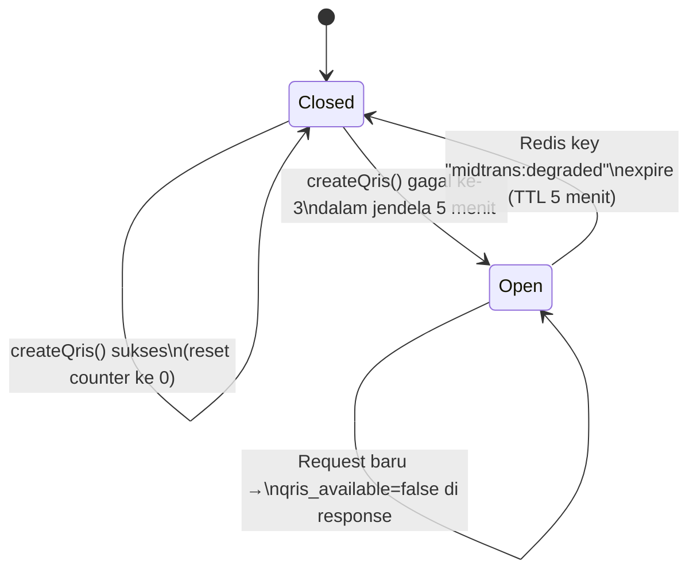
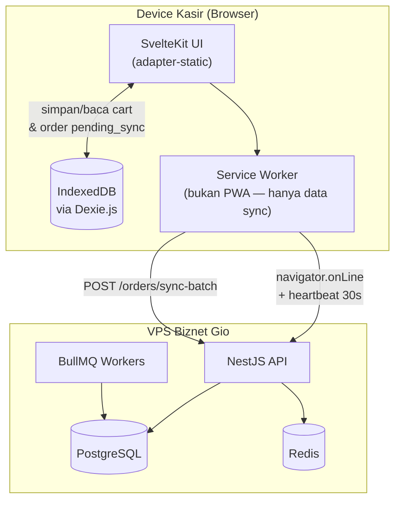
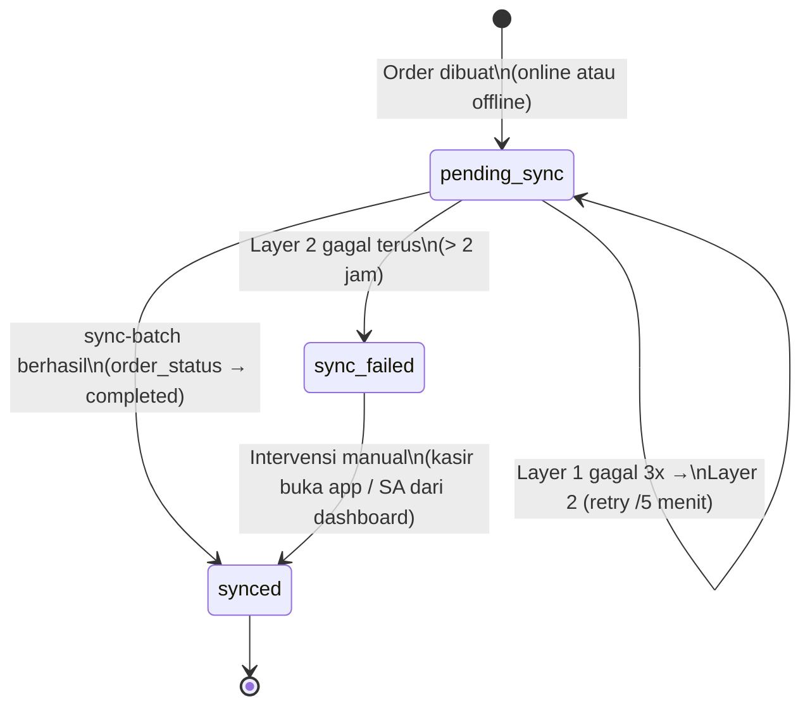

# 06. Arsitektur — Pola Aplikasi, Caching, Resiliency & Offline-First

*[← 05-nonfunctional-reqs.md](./05-nonfunctional-reqs.md) | [→ 07-database.md](./07-database.md)*

---

> **Konteks (lihat CR-010 di `00-overview.md`):** Bagian ini dijanjikan di Daftar Isi v4.0 sebagai bagian 11 ("Arsitektur Sistem & Infrastruktur") dan bagian 14 ("Offline-First Architecture"), tapi keduanya hilang dari isi. Bagian ini mengisi gap tersebut.

---

## 6.1 Pola Arsitektur Backend — Modular Monolith

### Penentuan Pola (Decision Framework)

| Pertanyaan | Jawaban Ngemiloh |
|---|---|
| Tim > 8 orang bekerja di area berbeda? | Tidak — tim 1–2 developer |
| Domain bisnis stabil & batasannya jelas? | Ya — domain POS sudah well-understood (RBAC, shift, order, produk) |
| Kebutuhan scaling berbeda drastis antar modul? | Tidak — seluruh modul punya beban serupa (1 outlet) |
| Tim sudah berpengalaman dengan distributed systems? | Tidak relevan — tidak dibutuhkan |

→ **Keputusan: Modular Monolith.** Bukan microservices (overhead operasional tidak sepadan untuk 1 VPS), dan bukan Clean Architecture 4-layer penuh (boilerplate akan memperlambat timeline Fase 1A yang hanya 14 hari untuk aplikasi CRUD-heavy). Didokumentasikan sebagai **ADR-013**.

> *Validasi Conway's Law:* struktur ini selaras dengan struktur tim (1–2 developer, tidak ada tim terpisah per-domain) — tidak ada *distributed monolith* yang muncul dari mismatch organisasi vs arsitektur.

### Struktur Folder

```
backend/src/
├── auth/              # FR-AUTH — session, guards, login PIN (kasir) & email/password (SA)
├── shift/             # FR-SHIFT — buka/tutup shift, kas awal, carry-over, auto-close
├── orders/            # FR-TRX — order, payment, void, sync-batch
├── products/          # FR-PROD — produk, kategori, modifier, scheduled price change
├── discounts/         # FR-DISC — diskon, kalkulasi harga (lihat 10-testing.md: mutation testing)
├── receipts/          # FR-RCPT — generate struk (nomor transaksi, format 58/80mm)
├── hpp/               # FR-HPP — estimated_hpp (Fase 1A) + BOM/raw_materials (Fase 1B)
├── reports/           # FR-RPT — analytics, profit-share (bagi hasil)
├── cashiers/          # FR-CSH — manajemen akun kasir
├── settings/          # FR-SET — settings global, feature flags
├── system/            # FR-SYS — system_logs, /health, /admin/system-health
├── payment/           # Integrasi Midtrans — diisolasi via interface PaymentGateway (lihat di bawah)
├── jobs/              # BullMQ processors: scheduled price change, auto-close shift,
│                      #   backup harian, pembersihan log lama (12-monitoring.md)
└── common/            # AppException hierarchy (6.6), decorators, pipes, interceptors,
                       #   RolesGuard, rate-limit guard
```

**Aturan per modul:**
- 1 `*.controller.ts` (HTTP layer, validasi DTO via `class-validator`)
- 1 `*.service.ts` (business logic)
- Akses data via Prisma (tidak ada repository layer terpisah — overhead tidak sepadan di skala ini)
- Unit test untuk `*.service.ts`, integration test (Supertest) untuk `*.controller.ts`

### Satu-satunya Bagian "Hexagonal-ish": Modul `payment/`

Modul `orders/` **tidak pernah memanggil Midtrans SDK langsung**. Semua panggilan eksternal lewat interface:

```typescript
// payment/payment-gateway.interface.ts
export interface PaymentGateway {
  createQris(orderId: string, amount: number): Promise<QrisResult>;
  verifyWebhookSignature(payload: unknown, signature: string): boolean;
}

// payment/midtrans-gateway.service.ts  → implementasi real (Midtrans SDK)
// payment/fake-gateway.service.ts      → implementasi untuk unit test orders/
```

Manfaat: unit test `orders.service.spec.ts` tidak butuh Midtrans sandbox sungguhan — cukup `FakePaymentGateway`, mendukung target coverage 85–95% di `05-nonfunctional-reqs.md` §5.7 tanpa flaky test akibat dependency eksternal.

---

## 6.2 Caching Strategy

| Data | Strategi | TTL | Invalidasi |
|---|---|---|---|
| `GET /products` (+ modifier + diskon aktif) | Cache-aside (Redis) | 5 menit | **Eksplisit** — `DEL` saat ada `POST/PATCH` di `/admin/products/*`, `/admin/discounts/*`, `/admin/categories/*` (jangan andalkan TTL saja, agar perubahan harga langsung terlihat kasir) |
| `GET /admin/settings` | Cache-aside (Redis) | 10 menit | `DEL` saat `PUT /admin/settings` |
| Session pengguna | Redis (bukan cache, source of truth) | Sesuai role (AUTH-03/04) | — |
| Rate limit counters | Redis | Per window (`09-security.md`) | — |
| Circuit breaker Midtrans (lihat 6.3) | Redis | 5 menit | Auto-expire |
| `feature_flags` | In-memory + TTL pendek | 60 detik | Toggle SA jarang terjadi; TTL pendek cukup, tanpa pub/sub |

> **Catatan desain (untuk developer baru yang bertanya "kok tidak ada X"):** Cache stampede prevention (mutex/locking saat cache miss) **sengaja tidak diimplementasikan** — traffic <10 req/detik tidak akan menimbulkan thundering herd pada satu key. Ditinjau ulang hanya jika Fase 3 (multi-outlet) meningkatkan traffic signifikan.

---

## 6.3 Circuit Breaker — Midtrans (ADR-014)

Panduan SDLC merekomendasikan circuit breaker untuk panggilan API eksternal (Midtrans sebagai contoh eksplisit). v4.0 hanya punya fallback UX (tombol QRIS disabled saat offline). v4.1 menambahkan **circuit breaker ringan berbasis Redis counter** — tanpa library tambahan (resilience4j-style dianggap berlebihan untuk 1 endpoint eksternal).

### State Diagram



### Implementasi

```typescript
// payment/midtrans-circuit.service.ts
const FAILURE_THRESHOLD = 3;
const WINDOW_SECONDS = 300;   // 5 menit
const DEGRADED_TTL = 300;     // 5 menit

async onCreateQrisFailure() {
  const count = await redis.incr('midtrans:fail_count');
  if (count === 1) await redis.expire('midtrans:fail_count', WINDOW_SECONDS);

  if (count >= FAILURE_THRESHOLD) {
    await redis.set('midtrans:degraded', '1', 'EX', DEGRADED_TTL);
    await logSystemEvent({
      severity: 'warning',
      log_type: 'payment_error',
      message: `Midtrans circuit OPEN — ${count} kegagalan QRIS dlm 5 menit`,
    });
    await sendEmailAlert('nabilah.fnb@gmail.com', 'QRIS Gangguan — Circuit Breaker Aktif');
  }
}

async onCreateQrisSuccess() {
  await redis.del('midtrans:fail_count'); // reset
}

async isDegraded(): Promise<boolean> {
  return (await redis.get('midtrans:degraded')) === '1';
}
```

### Integrasi ke Response & UI

- `GET /products` menambahkan field `"qris_available": boolean` pada response (hasil `isDegraded()`).
- Frontend (SvelteKit): jika `qris_available === false`, tombol QRIS disembunyikan + banner *"QRIS sedang gangguan, gunakan Tunai"* (re-use komponen UX yang sama dengan TC-06 — kondisi offline).
- **Auto-recovery**: tanpa intervensi manual — saat TTL `midtrans:degraded` habis, request berikutnya kembali mencoba Midtrans (Half-Open implisit lewat percobaan natural kasir berikutnya).

### Perbedaan dengan `feature_flags`

| | Circuit Breaker (`midtrans:degraded`) | `feature_flags.QRIS_PAYMENT` |
|---|---|---|
| Siapa yang ubah | Sistem otomatis | Superadmin manual |
| Lifetime | Ephemeral, auto-expire 5 menit | Persisten sampai diubah SA |
| Tujuan | Gangguan sementara Midtrans | Keputusan bisnis (mis. matikan QRIS permanen) |

Keduanya **AND** — QRIS tersedia hanya jika `feature_flags.QRIS_PAYMENT = true` **DAN** `qris_available = true` (circuit Closed).

---

## 6.4 Idempotency — Pembayaran & Void

`client_uuid` sudah menangani idempotency `POST /orders` (TC-08, sudah ada di v4.0). Yang belum tertangani: *race condition* pada `POST /orders/:id/payment` dan `POST /admin/orders/:id/void` saat tombol di-tap 2× cepat — kedua request bisa membaca `payment_status='pending'` sebelum salah satu commit.

### Solusi: Row-Level Lock (bukan header `Idempotency-Key` baru)

```sql
BEGIN;
SELECT * FROM orders WHERE id = $1 FOR UPDATE;  -- request kedua menunggu di sini
-- cek payment_status / order_status, lalu proses
COMMIT;
```

### Sequence Diagram — Double-Tap "Bayar Tunai"

```mermaid
sequenceDiagram
    participant K as Kasir (2x tap cepat)
    participant A as NestJS (Request A)
    participant B as NestJS (Request B)
    participant DB as PostgreSQL

    K->>A: POST /orders/:id/payment
    K->>B: POST /orders/:id/payment
    A->>DB: BEGIN; SELECT...FOR UPDATE
    DB-->>A: row locked (payment_status='pending')
    B->>DB: BEGIN; SELECT...FOR UPDATE
    Note over B,DB: Request B menunggu (lock held by A)
    A->>DB: UPDATE payment_status='settled'; COMMIT
    DB-->>B: lock released, row terbaru\n(payment_status='settled')
    A-->>K: 200 OK — pembayaran tercatat
    B-->>K: 409 ORDER_ALREADY_PAID
```

Request kedua **tidak error/crash** — cukup mendapat respons idempotent yang jelas. UI menampilkan ini sebagai info ("Pesanan sudah dibayar"), bukan error merah.

### Kode Error Baru (lihat juga `08-api-contract.md`)

| Kode | HTTP | Kapan |
|---|---|---|
| `ORDER_ALREADY_PAID` | 409 | *(sudah ada v4.0)* — payment dipanggil saat `payment_status` bukan `pending` |
| **`ORDER_ALREADY_VOIDED`** | 409 | **Baru (CR-012)** — `POST /admin/orders/:id/void` dipanggil 2× pada order yang sama, lock pattern sama seperti di atas |

---

## 6.5 Offline-First Architecture

### Komponen



### State Machine Sinkronisasi (per-order)

Memformalkan 2-Layer Retry (sudah benar secara konsep di OFFL-04 v4.0) sebagai diagram, **+ menambahkan state `sync_failed`** yang sudah disebut OFFL-04 tapi belum ada di enum `order_status` (CR-013):



`sync_failed` ditampilkan di UI kasir sebagai badge merah pada riwayat transaksi lokal — kasir diarahkan untuk tetap online beberapa menit agar retry manual (tombol "Coba Sync Ulang") dapat dipicu.

### Penanganan Konflik — Produk Di-archive Saat Order Masih Pending Sync

**Skenario:** Kasir offline membuat order untuk Produk X. Sebelum order ter-sync, SA (di lokasi lain, online) men-set `products.is_active = false` untuk Produk X.

**Resolusi (sudah benar by-design, dipertegas di v4.1):** `order_items` menyimpan **snapshot** lengkap (`product_name_snapshot`, `base_price`, dll — skema 10.8 v4.0) saat order dibuat di client. `product_id` tetap valid (`ON DELETE RESTRICT`, produk tidak dihapus — hanya `is_active=false`). Sync **tetap diterima** karena tidak ada validasi "produk harus aktif" di endpoint sync — hanya "produk harus *exist*". Tidak ada perubahan kode dibutuhkan; ini didokumentasikan sebagai **kasus uji eksplisit TC-17** (`10-testing.md`) agar tidak ter-regresi di masa depan.

### Partial Failure pada `sync-batch`

FR-TRX-06 v4.0 sudah benar secara struktur (`results: [{transaction_number, status, error?}]` per order). v4.1 menegaskan **semantik per-order transaction**:

- `POST /orders/sync-batch` menerima N order dalam 1 request.
- **Setiap order diproses dalam transaction DB-nya sendiri** — order yang valid **tetap commit** meski order lain dalam batch yang sama gagal validasi (mis. `product_id` tidak ditemukan karena typo client lama).
- Order yang gagal **tetap `pending_sync`** di IndexedDB client, ditampilkan dengan detail error per-order (OFFL-07 sudah mendukung UI ini).
- **Validasi tambahan (baru):** `client_created_at` setiap order harus berada dalam rentang waktu shift aktif kasir tersebut (± toleransi 5 menit untuk clock drift). Jika di luar rentang → order ditolak dengan kode error spesifik, mencegah manipulasi waktu transaksi untuk mengubah laporan kas shift (lihat mini threat-model di `09-security.md`).

Didokumentasikan sebagai kasus uji **TC-19** (`10-testing.md`).

---

## 6.6 Error Handling — `AppException` Hierarchy

Mengikat seluruh keputusan di atas ke format response API final (CR-005, ADR-015):

```typescript
// common/exceptions/app-exception.ts
export class AppException extends HttpException {
  constructor(
    public readonly code: string,            // → field "error" di response
    message: string,                          // → field "message"
    httpStatus: number,
    public readonly details?: Record<string, unknown>,
  ) {
    super({ error: code, message, details }, httpStatus);
  }
}

// Contoh penggunaan di orders.service.ts:
throw new AppException(
  'ORDER_ALREADY_PAID',
  'Pesanan ini sudah dibayar.',
  HttpStatus.CONFLICT,
);
```

Global exception filter (NestJS) menambahkan `timestamp` + `path` secara otomatis, menghasilkan format final:
```json
{
  "statusCode": 409,
  "error": "ORDER_ALREADY_PAID",
  "message": "Pesanan ini sudah dibayar.",
  "details": null,
  "timestamp": "2026-06-15T08:30:00.000Z",
  "path": "/api/v1/orders/abc-123/payment"
}
```

---

## 6.7 Ringkasan ADR Bagian Ini

| ADR | Judul | Status |
|---|---|---|
| ADR-013 | Modular Monolith — Struktur Folder per Domain (6.1) | Diusulkan — file lengkap di Tahap 8 |
| ADR-014 | Circuit Breaker Midtrans via Redis Counter (6.3) | Diusulkan — file lengkap di Tahap 8 |
| ADR-015 | Format Response API: Object-Direct + Error Envelope (6.6, CR-005) | Diusulkan — file lengkap di Tahap 8 |
| ADR-005 (revisi) | Tidak Partisi `orders` di Fase 1–2 + Exit Criteria (5.3) | Diusulkan — file lengkap di Tahap 8 |
| ADR-016 | Format Nomor Transaksi `TRX-YYYYMMDD-[Huruf][Seq3]` (CR-002) | Diusulkan — file lengkap di Tahap 8 |

---

*Lanjut ke: [`07-database.md`](./07-database.md) — Skema final, ERD, seed data, dan Prisma schema (Tahap 4).*
